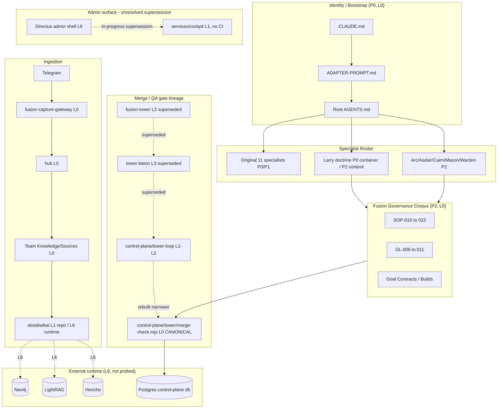

# 04 — Lifecycle and Reachability

Evidence-only. Where liveness cannot be verified from repository evidence alone (this audit did not probe any
live VPS or service, per boundary), the component is marked **L6 external-runtime unknown**, not asserted
active or dead.

## Active execution paths (CI-verified, L0)

| Path | CI evidence | What it proves |
|---|---|---|
| `services/control-plane/{db,worker,gate,ingress,notifier,review,tower-loop}` | `control-plane-tests.yml` runs `test:db`, `test:contract`, `test:registry`, `test:runtime`, `test:worker`, `test:wpc`, `test:wpd0`, `test:notifier`, `test:tower-loop`, `test:tower-loop-unit` | Every named module is exercised by a real test run on every push |
| `services/control-plane/tower/merge-check.mjs` | Same workflow; also textually confirmed as "Tower's active gate" in its own README, with a real merge withheld by it earlier today (`db29c09`) | Current canonical exact-head merge gate, in active use, not merely tested |
| `services/fusion-capture-gateway/` | Dedicated `fusion-capture-gateway-tests.yml`: `unit`, `deno-check` (against the real edge-function import graph), `integration` (against throwaway Postgres) | Full-stack tested including the Deno edge function |
| `services/hub/` | `build-002-tests.yml` `hub` job + dedicated `voice-sapi-windows` job (real Windows SAPI transcription proof) | Includes a real OS-level integration test, not just unit coverage |
| `services/asdair/{skill,outcome}/` | Dedicated `asdair-tests.yml` (`unit` + DB-gated `integration`), also `build-002-tests.yml`'s `asdair-skill` job and `wp-d-proof`'s `add-list-item`/`youtube-retry` DB tests | Triple-covered; also has a real merge event today (PR #73, BUILD-015) |
| 8 of 10 GitHub Actions workflows | Each path-filters its own service directory | See `01`, component C032 |

## Agent-routing paths (L0)

`.claude/agents/{16 slugs}.md` → `Team/<Name> - <Role>/AGENTS.md` — every one of the 16 specialist shims
(11 original + 5 Fusion-created) resolves to a matching contract file; confirmed no dangling shim and no
orphaned contract (16 shims, 16 contract folders, 1:1). Root `AGENTS.md` §"The team" and
`Team/agent-index.md` both enumerate the same 16.

## Build and QA paths (L0)

```
Work Order issued (per SOP-022 Preflight)
  → worker executes (services/control-plane/worker/*, durable Postgres queue)
    → PR opened
      → GitHub Actions CI runs (path-filtered per service)
        → services/control-plane/tower/merge-check.mjs (exact-head gate, headGuard())
          → reviewer adapter (services/control-plane/review/{codexAdapter,fableAdapter}.mjs)
            → verdict bound to canonicalised SHA (ops.canonicalize_sha)
              → merge (Warwick's explicit gate) OR withheld (evidenced today, BUILD-015/PR#73 predecessor path)
```

## Ingestion paths (L0, one live-verified L6 branch)

```
Telegram message
  → services/fusion-capture-gateway (live long-poll runner, durable store)
    → services/hub (channel-neutral routing, governed vault writer)
      → Team Knowledge/Sources/ (Cairn intake, SOP-015/016) [L0, repo-verified]
        → services/obsidiwikai (LightRAG/Neo4j compiler) [L1 repo / L6 external runtime]
          → external Neo4j + LightRAG containers on a Hetzner/Coolify host (ops/README.md,
            HANDOFF-CODEX.md; same tailnet IP independently referenced from 4 subsystems;
            NOT verified live from this audit — boundary respected]
```

## Persistence paths

- **Postgres (`services/control-plane/db/`)**: the authoritative store for merge-QA state, worker queue,
  policy gate decisions. L0, migration-tracked.
- **`mypka.db`**: a tracked, regeneratable SQLite mirror of the markdown vault. L0 as a fallback artefact, but
  `git log --oneline -- mypka.db` shows exactly **one** commit in this repo's history — it is not regenerated
  as part of normal doctrine PRs (confirmed directly during tonight's session).
- **Supabase (`supabase/config.toml`, `supabase/functions/fcg-webhook-intake`)**: local CLI config + one edge
  function only. **No live database schema is committed to this repo** — the actual Supabase project is
  external. L6 for the live database itself, L0 for the one committed edge function's code.

## Cloud/runtime paths (L6 — external, not verified)

No `Dockerfile` or `docker-compose*` exists anywhere in this repository (confirmed repo-wide). What exists is
integration/config code referencing:

| External system | Referencing components | Verification status |
|---|---|---|
| Directus | `services/cockpit/`, `services/control-plane/`, `services/hub/`, `services/obsidiwikai/` (133 files total) | L6 — a Windows scheduled task name (`MyPKA-Directus-Live`) is documented in a session log but not present in this repo's own config; cannot be confirmed running from static evidence |
| Neo4j | `services/cockpit/`, `services/control-plane/`, `services/obsidiwikai/` (78 files) | L6 — deployment doc exists (`ops/README.md`), container not probed |
| LightRAG | `services/control-plane/`, `services/obsidiwikai/` (61 files) | L6 — same deployment doc |
| Honcho | `services/control-plane/`, `services/hub/`, `services/obsidiwikai/` (62 files) | L6 |
| Hetzner/Coolify host (tailnet `100.101.240.85`) | Independently referenced from `services/cockpit/public/app.js`, `services/control-plane/cockpit/*`, the Directus extension, and `services/obsidiwikai/ops/` | L6 — consistent cross-referencing from 4 unrelated subsystems is strong circumstantial evidence of one real shared host, but this audit did not and must not probe it |

## Current canonical interfaces

- **Merge gate**: `services/control-plane/tower/merge-check.mjs` (generation 4 of 4 — see `05` for the
  supersession chain of the three predecessors).
- **Admin/output front door**: **unresolved between two candidates**, evidenced as an in-progress, not
  completed, supersession. `services/control-plane/wp-d-proof/directus/` (Directus admin shell, live via
  `MyPKA-Directus-Live` per session log) vs. `services/cockpit/` (explicitly documented as its intended
  replacement, commits through today, but zero CI coverage and no scheduled-task evidence of its own).
- **Specialist routing**: `.claude/agents/*.md` → `Team/*/AGENTS.md`, uniformly for all 16 specialists.

## Dormant or broken paths

- `Expansions/app-developer/`, `Expansions/designer-pack/` — confirmed dormant as folders (nothing routes to
  them at runtime); the capability they seeded is live elsewhere (the merged `Team/` contracts).
- `.codex/agents/*.toml` — dormant pending Warwick's own already-flagged dedicated review; not resolved here.
- `services/control-plane/wp-d-proof/prove-*.mjs` (~40 scripts) — explicitly documented in `build-002-tests.yml`
  comments as live-synthetic-only, never run in CI.

## Duplicate paths

Full detail in `05-defunct-duplicate-and-superseded-candidates.md`. Summary: the Tower/merge-QA lineage has
four generations (`fusion-tower` → `tower-baton` → `control-plane/tower-loop` (parked) →
`control-plane/tower/merge-check.mjs`, canonical); the admin-surface lineage has two overlapping candidates
(Directus, `services/cockpit`) with no confirmed cutover.

## Unreachable components

None found meeting the full L4 defunct-candidate standard (see `05` — everything with weak evidence was
classified QUARANTINE CANDIDATE, not DELETE).

## Unresolved external-runtime dependencies

All of: Directus liveness, Neo4j/LightRAG container liveness, the Hetzner/Coolify host's current state, and
whether `MyPKA-Directus-Live`'s scheduled task is still installed. Each is L6 by design of this audit's
boundary — not resolved, not guessed at.

## Dependency diagram



This diagram reflects only what the evidence supports: solid arrows are repo-confirmed data/control flow,
dotted arrows are either supersession relationships or unverified external calls. It deliberately omits any
box for a component this audit could not evidence — no decorative architecture.
